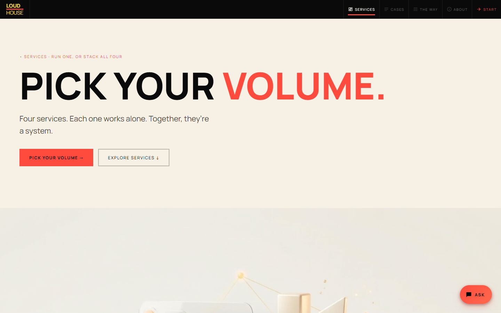
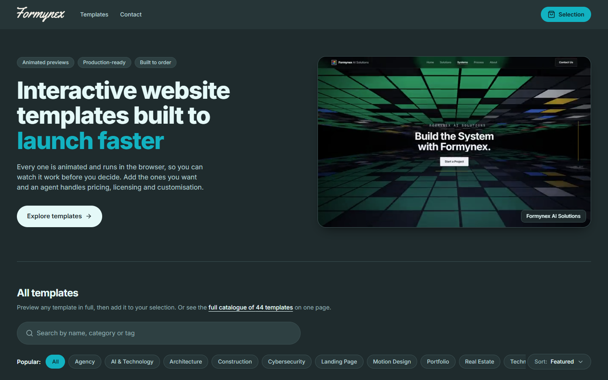
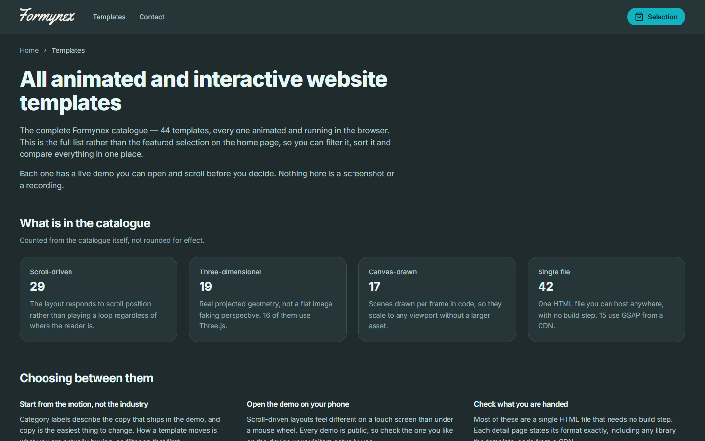
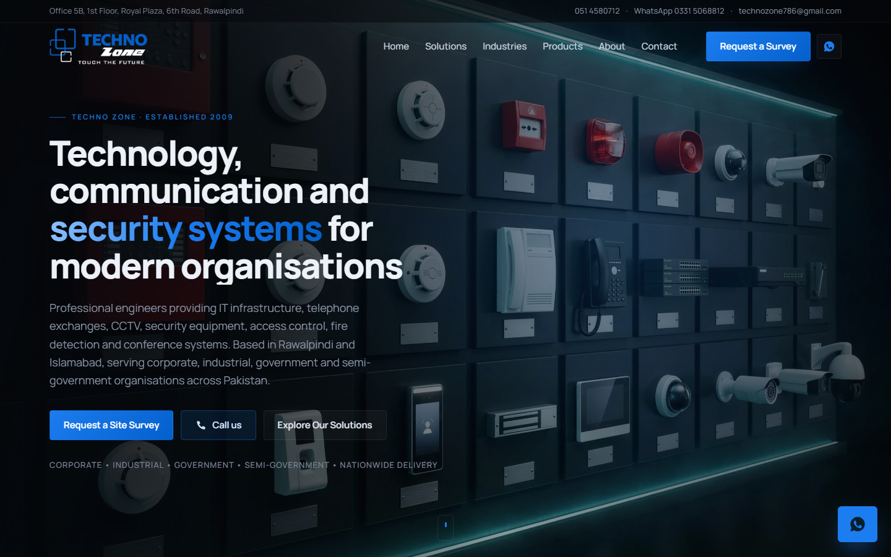
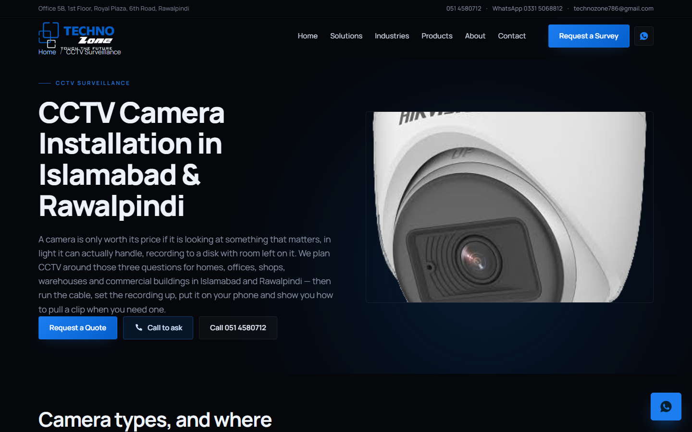
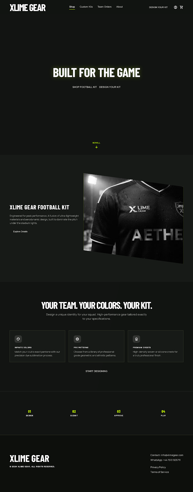
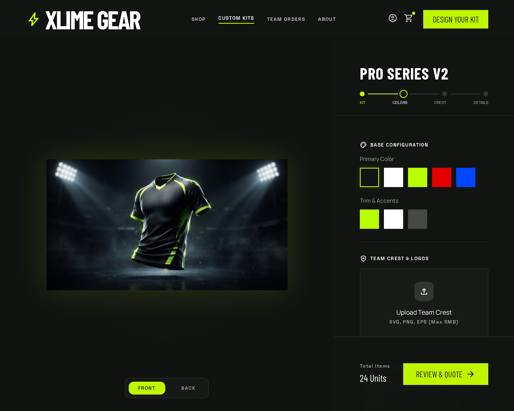

# Muhammad Hamza Habib Hashmi

Full stack developer building web applications, AI-powered products and the infrastructure behind them.

Most of my recent work is client sites and products that have to hold up in production: React and Next.js front ends with real motion and 3D work, Node and Python back ends, and the SEO and performance work that decides whether any of it gets found. Before that I spent several years on ML systems — computer vision, speech, model deployment on cloud and edge — which still shows up in the AI features I build into web products today.

Based in Islamabad, Pakistan.

**What I work with**

React · Next.js · TypeScript · Three.js · GSAP · Framer Motion · Node.js · Express · Python · Flask · MongoDB · PostgreSQL · Prisma · Supabase · Docker · Kubernetes · AWS · Vercel

---

## Featured work

### Loudhouse Marketing

Loudhouse is a marketing agency in Islamabad. They wanted a site that behaved like an agency reel rather than a brochure, so the build leans hard on motion: a Times Square hero, a scroll-scrubbed film sequence on the About page, and an exploded 3D speaker on Services and Work that comes apart as you scroll. It also does real work — leads land in MongoDB and trigger an email, and two Groq-backed endpoints run the site chatbot and a short discovery quiz that recommends a service stack.

The About page was the interesting problem. Scrubbing a `<video>` off scroll position isn't frame-accurate across browsers, so the 4K master gets decoded into WebP stills at build time and painted to a canvas instead. That worked on desktop and killed mobile — holding 181 decoded bitmaps costs about 1.5 GB on a phone. Halving the frame stride and decoding straight to the painted size brought it down to roughly 139 MB and the page back to a usable frame rate.

**Tech stack:** React 18, Vite, Three.js, React Three Fiber, GSAP ScrollTrigger, Framer Motion, Lenis, Express, MongoDB/Mongoose, Nodemailer, Groq API, Vercel

**What I built:** the whole front end and its motion system, the procedural Three.js speaker, the scroll-film pipeline and its mobile memory fix, the Express API and Vercel serverless functions for leads and chat, per-route SEO with canonicals and JSON-LD, and a set of Puppeteer scripts that check scroll smoothness, reduced-motion behaviour and layout overflow across viewports.

**Live:** https://loudhouse-marketing.com · **Repository:** private · [Full write-up →](projects/loudhouse.md)

---

### Formynex

Formynex sells animated website templates. The pitch is that you don't buy from a screenshot — every one of the 44 templates in the catalogue is a live demo you can open and scroll before you decide. Visitors shortlist what they want into a selection drawer and hand it to an agent, since the templates are sold by conversation rather than checkout.

The site started as a single-page SPA that served one empty `
` for every URL with a hard-coded canonical pointing at the wrong host — nine template pages all telling Google they were the same page. I added an SSR build step and a prerenderer, so every route ships as real HTML with its own metadata, and both the build script and the client import the same SEO module so the two can't drift apart. Preview media only mounts as it approaches the viewport, videos pause when they scroll away, and `prefers-reduced-motion` gets a static poster instead.

**Tech stack:** React 18, TypeScript, Vite, Tailwind CSS, Framer Motion, React Router, Vercel

**What I built:** the catalogue and filtering UI, the selection drawer with localStorage persistence, the SSR prerender pipeline, sitemap and robots generation, JSON-LD, the lazy animated-preview component, a responsive audit script that shoots every route at 320/768/1440, and a contrast checker.

**Live:** https://formynex.site · **Repository:** private · [Full write-up →](projects/formynex.md)

---

### Techno Zone

Techno Zone is a Rawalpindi company that has been installing CCTV, access control, fire alarms, telephone exchanges and solar systems since 2009. They needed to show up when someone searches for those services in Islamabad or Rawalpindi, which meant a page per service rather than one list.

Rather than pull in a framework for a site that is mostly content, I wrote a small Node generator with no dependencies. Service and support pages are rendered from data files into static HTML that gets committed to the repo, along with the sitemap — so deploys stay a plain file upload with no build step in the pipeline. Every phone number, address and service name comes from one config object, and nothing on the site is a claim the owner didn't give me.

**Tech stack:** Node.js (static generator), HTML, CSS, vanilla JavaScript, Vercel

**What I built:** the generator and its content model, the design and front-end, twelve service landing pages, LocalBusiness and Service JSON-LD, sitemap and robots output, WhatsApp and call-tracking hooks, and the image pipeline for the product and equipment shots.

**Live:** https://www.technozoneisb.online · **Repository:** private · [Full write-up →](projects/technozone.md)

---

### XLIME GEAR

A 13-screen prototype for a custom football kit brand — storefront, product detail, a step-by-step jersey builder, cart and checkout, account, team bulk ordering, and an admin side for reviewing orders. The builder is the centre of it: pick a kit, set primary and trim colours, upload a crest, then send the whole thing off as a quote rather than a card payment, because team orders get priced per job.

The deliverable was the awkward part. The client needed to review all thirteen screens without a dev environment, so I built a single self-contained HTML file that embeds every original page byte-for-byte plus its screenshot, with a branded landing page and a device-framed live viewer in front of them. A verification step decodes each embedded page back out and byte-compares it to the source, so nothing is quietly lost in the packaging.

**Tech stack:** HTML, Tailwind CSS, design tokens, Node.js build script

**What I built:** the screen designs and the dark motion-led design system behind them, the jersey builder flow, the admin views, and the single-file packaging and verification script.

**Status:** design prototype, not deployed · **Repository:** private · [Full write-up →](projects/xlimegear.md)

---

## Also built

Smaller or in-progress projects, all private repositories:

**StudyPath Global** — university discovery and study-abroad platform. Next.js 14, Prisma, PostgreSQL, Tailwind. Country and scholarship pages, a cost calculator, a comparison tool and an admin area.

**Europass CV Maker** — CV builder with drag-and-drop section reordering and PDF export. Next.js, Supabase, `@react-pdf/renderer`, dnd-kit, React Hook Form and Zod.

**Upwork Opportunity Radar** — market-intelligence dashboard that ranks Upwork categories and skills by opportunity quality. Next.js, Drizzle ORM, Neon Postgres, Radix UI, Vitest and Playwright.

**NEXA Studio** — local-first generative media studio for images, video and audio. Next.js front end, Python API and worker, Docker Compose with an optional GPU path so the models run on your own machine.

**Tools & Calculators** — around forty single-purpose tools (GPA, finance, image, JSON, Base64, QR) as static Next.js 15 routes, each one its own indexable page.

**Text Copy Platform** — real-time chat with contacts and push notifications. Express, PostgreSQL, JWT auth, web-push, deployed on Vercel.

---

## Earlier work

Machine learning and cloud work from before I moved mostly to product and web. Full descriptions, images and demo audio are in [projects/ai-and-cloud-work.md](projects/ai-and-cloud-work.md).

**[Callup.ai](https://callup.ai)** — AI voice calling agents. Python and Node behind an Express layer, RAG retrieval, and LLM function calling. Worked on cutting response latency and improving voice realism. ([demo audio](public/airesults.mp3))

**Disease detection from eye scans** — TFLite model quantised to run on edge devices at 60 FPS.

**Real-time STT/TTS avatars** — generative face and voice models with Roop and LoRA fine-tuning. ([demo video](public/aimodel.mp4))

**Virtual try-on** — computer vision and generative imaging for e-commerce fitting.

**2D image to 3D model** — single-image 3D reconstruction, Python backend with a Rails interface.

**Kubernetes scaling for a fintech** — Docker, Kubernetes and Kubeflow for model serving, with AWS Lambda bringing inference cost down to about $1 per 1000 requests.

**Sales automation** — Power Automate and Microsoft Cloud workflows with Go High Level, Calendly and Cal.com integrations, plus a monitoring dashboard.

**Shredded Apes** — Web3 staking, raffle, auction and commerce platform. Rust backend, React front end.

---

## More

[Background and skills in detail](experience.md)

[LinkedIn](https://www.linkedin.com/in/muhammad-hamza5) · [GitHub](https://github.com/muhammadhamzahabibhashmi/)
