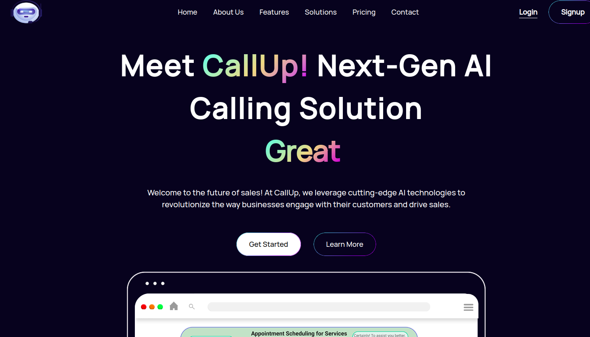
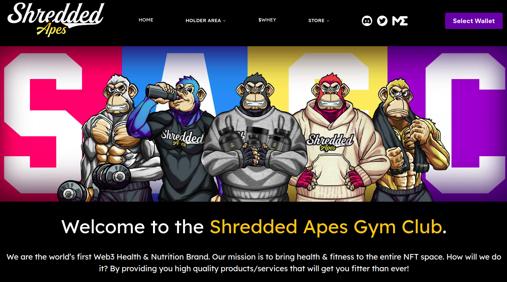

# Hamza Habib Hashmi

Full Stack Developer building modern web applications, AI-powered products, and scalable digital experiences.

Welcome to my GitHub profile! I have a diverse skill set in various cutting-edge technologies. Below is a showcase of some of the projects I've worked on.

---

## About Me

👨‍💼 **Profession:** Solutions Architect  
🔧 **Skills:** Python, Flask, Rust, AWS, Microsoft Cloud, C#, Java, TFLite, C++, Docker, Kubernetes, AWS Lambda, Generative AI, Computer Vision, Image Processing, Electron.js

I specialize in:
- Developing scalable, secure, and efficient solutions tailored to client needs.
- Creating innovative AI models and integrating them into practical applications.
- Enhancing user experience through cutting-edge web and mobile technologies.
- Leading cross-functional teams to deliver high-impact projects on time and within budget.
- Implementing cloud infrastructure and DevOps practices to optimize performance and reduce costs.
- **Technologies:** Python, Node.js, Next.js, Express, Rust, React.js, Microsoft Cloud, Power Automate, C#, Ruby on Rails, Java, TFLite, C++, Docker, Kubernetes, AWS Lambda, Generative AI, Computer Vision, Image Processing, Electron.js

**Recent front-end and product work:** React · Next.js · TypeScript · Three.js · GSAP · Framer Motion · Tailwind · Prisma · Supabase · Vercel

---

## Achievements

- Successfully deployed over 200 models from POC/MVP to production, demonstrating expertise in transforming innovative ideas into robust, scalable solutions.
- Achieved a 30% increase in sales efficiency and reduced manual intervention through automation.
- Improved early detection rates and patient outcomes with innovative AI technology in healthcare.
- Reduced operational costs to $1 per 1000 requests by leveraging AWS Lambda and scalable infrastructure.
- Enhanced customer satisfaction and reduced return rates with advanced virtual try-on solutions.
- Increased user engagement and transaction volume by implementing innovative features in blockchain projects.
- Streamlined the sales process and improved conversion rates with automated outreach workflows.
- Led cross-functional teams to deliver high-impact projects on time and within budget.

---

## Recent Projects

### Loudhouse Marketing

Loudhouse is a marketing agency in Islamabad. They wanted a site that behaved like an agency reel rather than a brochure, so the build leans hard on motion: a Times Square hero, a scroll-scrubbed film sequence on the About page, and an exploded 3D speaker on Services and Work that comes apart as you scroll. It also does real work — leads land in MongoDB and trigger an email, and two Groq-backed endpoints run the site chatbot and a short discovery quiz that recommends a service stack.

The About page was the interesting problem. Scrubbing a `<video>` off scroll position isn't frame-accurate across browsers, so the 4K master gets decoded into WebP stills at build time and painted to a canvas instead. That worked on desktop and killed mobile — holding 181 decoded bitmaps costs about 1.5 GB on a phone. Halving the frame stride and decoding straight to the painted size brought it down to roughly 139 MB and the page back to a usable frame rate.

**Tech Stack:** React 18, Vite, Three.js, React Three Fiber, GSAP ScrollTrigger, Framer Motion, Lenis, Express, MongoDB/Mongoose, Nodemailer, Groq API, Vercel

**Key Work:** the whole front end and its motion system, the procedural Three.js speaker, the scroll-film pipeline and its mobile memory fix, the Express API and Vercel serverless functions for leads and chat, per-route SEO with canonicals and JSON-LD, and a set of Puppeteer scripts that check scroll smoothness, reduced-motion behaviour and layout overflow across viewports.

**Repository:** private · [Full write-up →](projects/loudhouse.md)

---

### Formynex

Formynex sells animated website templates. The pitch is that you don't buy from a screenshot — every one of the 44 templates in the catalogue is a live demo you can open and scroll before you decide. Visitors shortlist what they want into a selection drawer and hand it to an agent, since the templates are sold by conversation rather than checkout.

The site started as a single-page SPA that served one empty `
` for every URL with a hard-coded canonical pointing at the wrong host — nine template pages all telling Google they were the same page. I added an SSR build step and a prerenderer, so every route ships as real HTML with its own metadata, and both the build script and the client import the same SEO module so the two can't drift apart. Preview media only mounts as it approaches the viewport, videos pause once they scroll away, and `prefers-reduced-motion` gets a static poster instead.

**Tech Stack:** React 18, TypeScript, Vite, Tailwind CSS, Framer Motion, React Router, Vercel

**Key Work:** the catalogue and filtering UI, the selection drawer with localStorage persistence, the SSR prerender pipeline, sitemap and robots generation, JSON-LD, the lazy animated-preview component, a responsive audit script that shoots every route at 320/768/1440, and a contrast checker.

**Live Demo:** https://formynex.site · **Repository:** private · [Full write-up →](projects/formynex.md)

---

### Techno Zone

Techno Zone is a Rawalpindi company that has been installing CCTV, access control, fire alarms, telephone exchanges and solar systems since 2009. They needed to show up when someone searches for those services in Islamabad or Rawalpindi, which meant a page per service rather than one list.

Rather than pull in a framework for a site that is mostly content, I wrote a small Node generator with no dependencies. Service and support pages are rendered from data files into static HTML that gets committed to the repo, along with the sitemap — so deploys stay a plain file upload with no build step in the pipeline. Every phone number, address and service name comes from one config object, and nothing on the site is a claim the owner didn't give me.

**Tech Stack:** Node.js (static generator), HTML, CSS, vanilla JavaScript, Vercel

**Key Work:** the generator and its content model, the design and front end, twelve service landing pages, LocalBusiness and Service JSON-LD, sitemap and robots output, WhatsApp and call-tracking hooks, and the image pipeline for the product and equipment shots.

**Live Demo:** https://www.technozoneisb.online · **Repository:** private · [Full write-up →](projects/technozone.md)

---

### XLIME GEAR

A 13-screen prototype for a custom football kit brand — storefront, product detail, a step-by-step jersey builder, cart and checkout, account, team bulk ordering, and an admin side for reviewing orders. The builder is the centre of it: pick a kit, set primary and trim colours, upload a crest, then send the whole thing off as a quote rather than a card payment, because team orders get priced per job.

The deliverable was the awkward part. The client needed to review all thirteen screens without a dev environment, so I built a single self-contained HTML file that embeds every original page byte-for-byte plus its screenshot, with a branded landing page and a device-framed live viewer in front of them. A verification step decodes each embedded page back out and byte-compares it to the source, so nothing is quietly lost in the packaging.

**Tech Stack:** HTML, Tailwind CSS, design tokens, Node.js build script

**Key Work:** the screen designs and the dark motion-led design system behind them, the jersey builder flow, the admin views, and the single-file packaging and verification script.

**Status:** design prototype, not deployed · **Repository:** private · [Full write-up →](projects/xlimegear.md)

---

### Also built

Smaller or in-progress projects, all private repositories:

**StudyPath Global** — university discovery and study-abroad platform. Next.js 14, Prisma, PostgreSQL, Tailwind. Country and scholarship pages, a cost calculator, a comparison tool and an admin area.

**Europass CV Maker** — CV builder with drag-and-drop section reordering and PDF export. Next.js, Supabase, `@react-pdf/renderer`, dnd-kit, React Hook Form and Zod.

**Upwork Opportunity Radar** — market-intelligence dashboard that ranks Upwork categories and skills by opportunity quality. Next.js, Drizzle ORM, Neon Postgres, Radix UI, Vitest and Playwright.

**NEXA Studio** — local-first generative media studio for images, video and audio. Next.js front end, Python API and worker, Docker Compose with an optional GPU path so the models run on your own machine.

**Tools & Calculators** — around forty single-purpose tools (GPA, finance, image, JSON, Base64, QR) as static Next.js 15 routes, each one its own indexable page.

**Text Copy Platform** — real-time chat with contacts and push notifications. Express, PostgreSQL, JWT auth, web-push, deployed on Vercel.

---

## Projects

### [Callup.ai](https://callup.ai)
Voice calling agents built using AI transformers, Node.js, Python, and Next.js.

- **Technologies:** Python, Node.js, Express, Next.js
- **Key Features:**
  - Implemented secure multi-layer architecture with Python backend and Express server layer.
  - Enhanced AI call response latency and trained realistic-sounding AI voices.
  - Integrated RAG-based implementation for efficient data retrieval from databases.
  - Enabled function calling from LLM to tailor responses to client needs.
  - Achieved significant improvements in response time and voice quality, providing a competitive edge.

#### results
Voice sample: [airesults.mp3](public/airesults.mp3)

<audio controls>
    <source src="public/airesults.mp3" type="audio/mp3">
    Your browser does not support the audio tag.
</audio>

---

### AI Disease Detection Using Eye Scans
AI model to detect infections and stomach-related diseases from eye scans.

- **Technologies:** Java, Python, TFLite, C++
- **Key Features:**
  - Developed an AI model to analyze eye scans and detect diseases.
  - Implemented compatibility for edge devices to achieve real-time performance at 60 FPS.
  - Utilized TFLite for efficient model deployment on low-power devices.
  - Enhanced healthcare diagnostics through innovative AI technology.
  - Significantly improved early detection rates and patient outcomes.

---

### AI Models D-IDs
Created AI-based models with STT and TTS for real-time results.

- **Technologies:** Python, Node.js, Generative AI
- **Key Features:**
  - Developed high-quality, real-time AI models for STT and TTS.
  - Generated realistic faces and artificial models using generative AI techniques.
  - Implemented Roop and LoRA for enhanced model training and performance.
  - Delivered state-of-the-art AI solutions for various applications.
  - Improved user interaction and engagement with high-fidelity AI models.

#####  result
Video sample: [aimodel.mp4](public/aimodel.mp4)

<video controls>
    <source src="public/aimodel.mp4" type="video/mp4">
    Your browser does not support the video tag.
</video>

---

### Virtual Try-ons
Virtual try-on application using generative AI and computer vision.

- **Technologies:** Generative AI, Computer Vision, Image Processing
- **Key Features:**
  - Developed virtual try-ons allowing users to see themselves in different outfits.
  - Utilized advanced computer vision and image processing techniques for realistic try-ons.
  - Enhanced user experience with accurate and interactive virtual fitting.
  - Implemented generative AI to generate high-quality try-on images.
  - Increased customer satisfaction and reduced return rates for e-commerce platforms.

---

### Email Sales Automation for Business Process Automation
Automated sales processes using Microsoft cloud technologies.

- **Technologies:** Microsoft Cloud, Power Automate, Node.js, C#
- **Key Features:**
  - Developed automation workflows using Power Automate and Copilot.
  - Built a user-friendly dashboard for monitoring and managing sales activities.
  - Integrated Go High Level, Calendly, and Cal.com to streamline scheduling and follow-ups.
  - Enhanced efficiency and productivity through business process automation.
  - Achieved a 30% increase in sales efficiency and reduced manual intervention.

---

### High Fidelity 2D Image to 3D Model Creation
Transforms a single image into detailed 3D models.

- **Technologies:** Python, Generative AI, Ruby on Rails
- **Key Features:**
  - Developed a high-fidelity 3D creation technology for realistic digital content.
  - Achieved unprecedented realism and accuracy in 3D models from 2D images.
  - Integrated generative AI techniques to enhance model quality and detail.
  - Implemented using Python for backend processing and Ruby on Rails for web interface.
  - Enabled content creators to produce high-quality 3D models efficiently.

---

### Kubernetes for Vertical Scaling for a Fintech Company
Implemented scalable backend infrastructure.

- **Technologies:** Docker, Kubernetes, Kubeflow, AWS Lambda
- **Key Features:**
  - Built a highly scalable backend infrastructure using Docker and Kubernetes.
  - Implemented Kubeflow for efficient ML model deployment and management.
  - Leveraged AWS Lambda to reduce operational costs to $1 per 1000 requests to models.
  - Achieved significant performance improvements and cost savings.
  - Enabled the fintech company to scale operations seamlessly and efficiently.

---

### Sales Funnel for a Digital Marketing Company
Built a comprehensive sales funnel from prospecting and lead generation to automated outreach.

- **Technologies:** Node.js, Python, Microsoft Cloud, Power Automate
- **Key Features:**
  - Developed a multi-stage sales funnel for a digital marketing company.
  - Automated prospecting and lead generation processes to maximize efficiency.
  - Integrated automated outreach workflows to nurture and convert leads.
  - Utilized data analytics to refine targeting and improve conversion rates.
  - Increased lead conversion rates and streamlined the sales process.

---

### Shredded Apes
A complete project involving staking, raffle, auction, and eCommerce ecosystem using Web3 blockchain.

- **Technologies:** Node.js, Rust, React.js, Express.js
- **Key Features:**
  - Developed a comprehensive staking, raffle, and auction platform.
  - Created an eCommerce ecosystem leveraging Web3 blockchain technologies.
  - Built a robust Rust backend to handle complex transactions and ensure security.
  - Delivered a seamless user experience with React.js front-end.
  - Successfully increased user engagement and transaction volume through innovative features.

---

## More

[Background and skills in detail](experience.md)

## Connect with Me

