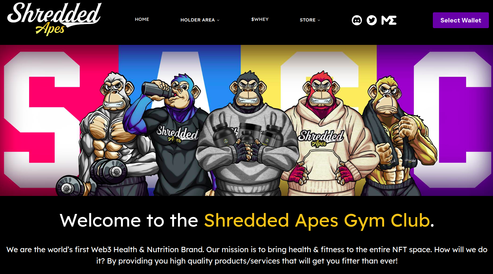

# Hamza Habib Hashmi

Welcome to my GitHub profile! I have a diverse skill set in various cutting-edge technologies. Below is a showcase of some of the projects I've worked on.

---

## About Me

👨‍💼 **Profession:** Solutions Architect  
🔧 **Skills:** Python, Flask, Rust, AWS, Microsoft Cloud, C#, Java, TFLite, C++, Docker, Kubernetes, AWS Lambda, Generative AI, Computer Vision, Image Processing, Electron.js

I specialize in:
- Developing scalable, secure, and efficient solutions tailored to client needs.
- Creating innovative AI models and integrating them into practical applications.
- Enhancing user experience through cutting-edge web and mobile technologies.
- Leading cross-functional teams to deliver high-impact projects on time and within budget.
- Implementing cloud infrastructure and DevOps practices to optimize performance and reduce costs.
- **Technologies:** Python, Node.js, Next.js, Express, Rust, React.js, Microsoft Cloud, Power Automate, C#, Ruby on Rails, Java, TFLite, C++, Docker, Kubernetes, AWS Lambda, Generative AI, Computer Vision, Image Processing, Electron.js

---

## Achievements

- Successfully deployed over 200 models from POC/MVP to production, demonstrating expertise in transforming innovative ideas into robust, scalable solutions.
- Achieved a 30% increase in sales efficiency and reduced manual intervention through automation.
- Improved early detection rates and patient outcomes with innovative AI technology in healthcare.
- Reduced operational costs to $1 per 1000 requests by leveraging AWS Lambda and scalable infrastructure.
- Enhanced customer satisfaction and reduced return rates with advanced virtual try-on solutions.
- Increased user engagement and transaction volume by implementing innovative features in blockchain projects.
- Streamlined the sales process and improved conversion rates with automated outreach workflows.
- Led cross-functional teams to deliver high-impact projects on time and within budget.

---

## Projects

### [Callup.ai](https://callup.ai)
Voice calling agents built using AI transformers, Node.js, Python, and Next.js.

- **Technologies:** Python, Node.js, Express, Next.js
- **Key Features:**
  - Implemented secure multi-layer architecture with Python backend and Express server layer.
  - Enhanced AI call response latency and trained realistic-sounding AI voices.
  - Integrated RAG-based implementation for efficient data retrieval from databases.
  - Enabled function calling from LLM to tailor responses to client needs.
  - Achieved significant improvements in response time and voice quality, providing a competitive edge.

 <!-- Replace with actual image URL -->
 <!-- Replace with actual image URL -->

#### results
<audio controls>
    <source src="public/airesults.mp3" type="audio/mp3">
    Your browser does not support the audio tag.
</audio>

---

### AI Disease Detection Using Eye Scans
AI model to detect infections and stomach-related diseases from eye scans.

- **Technologies:** Java, Python, TFLite, C++
- **Key Features:**
  - Developed an AI model to analyze eye scans and detect diseases.
  - Implemented compatibility for edge devices to achieve real-time performance at 60 FPS.
  - Utilized TFLite for efficient model deployment on low-power devices.
  - Enhanced healthcare diagnostics through innovative AI technology.
  - Significantly improved early detection rates and patient outcomes.

 <!-- Replace with actual image URL -->

---

### AI Models D-IDs
Created AI-based models with STT and TTS for real-time results.

- **Technologies:** Python, Node.js, Generative AI
- **Key Features:**
  - Developed high-quality, real-time AI models for STT and TTS.
  - Generated realistic faces and artificial models using generative AI techniques.
  - Implemented Roop and LoRA for enhanced model training and performance.
  - Delivered state-of-the-art AI solutions for various applications.
  - Improved user interaction and engagement with high-fidelity AI models.
 Replace with actual image URL

#####  result
<video controls>
    <source src="/public/aimodel.mp4" type="video/mp4">
    Your browser does not support the video tag.
</video>

---

### Virtual Try-ons
Virtual try-on application using generative AI and computer vision.

- **Technologies:** Generative AI, Computer Vision, Image Processing
- **Key Features:**
  - Developed virtual try-ons allowing users to see themselves in different outfits.
  - Utilized advanced computer vision and image processing techniques for realistic try-ons.
  - Enhanced user experience with accurate and interactive virtual fitting.
  - Implemented generative AI to generate high-quality try-on images.
  - Increased customer satisfaction and reduced return rates for e-commerce platforms.

 <!-- Replace with actual image URL -->

---

### Email Sales Automation for Business Process Automation
Automated sales processes using Microsoft cloud technologies.

- **Technologies:** Microsoft Cloud, Power Automate, Node.js, C#
- **Key Features:**
  - Developed automation workflows using Power Automate and Copilot.
  - Built a user-friendly dashboard for monitoring and managing sales activities.
  - Integrated Go High Level, Calendly, and Cal.com to streamline scheduling and follow-ups.
  - Enhanced efficiency and productivity through business process automation.
  - Achieved a 30% increase in sales efficiency and reduced manual intervention.

 <!-- Replace with actual image URL -->

---

### High Fidelity 2D Image to 3D Model Creation
Transforms a single image into detailed 3D models.

- **Technologies:** Python, Generative AI, Ruby on Rails
- **Key Features:**
  - Developed a high-fidelity 3D creation technology for realistic digital content.
  - Achieved unprecedented realism and accuracy in 3D models from 2D images.
  - Integrated generative AI techniques to enhance model quality and detail.
  - Implemented using Python for backend processing and Ruby on Rails for web interface.
  - Enabled content creators to produce high-quality 3D models efficiently.

 <!-- Replace with actual image URL -->

---

### Kubernetes for Vertical Scaling for a Fintech Company
Implemented scalable backend infrastructure.

- **Technologies:** Docker, Kubernetes, Kubeflow, AWS Lambda
- **Key Features:**
  - Built a highly scalable backend infrastructure using Docker and Kubernetes.
  - Implemented Kubeflow for efficient ML model deployment and management.
  - Leveraged AWS Lambda to reduce operational costs to $1 per 1000 requests to models.
  - Achieved significant performance improvements and cost savings.
  - Enabled the fintech company to scale operations seamlessly and efficiently.

---

### Sales Funnel for a Digital Marketing Company
Built a comprehensive sales funnel from prospecting and lead generation to automated outreach.

- **Technologies:** Node.js, Python, Microsoft Cloud, Power Automate
- **Key Features:**
  - Developed a multi-stage sales funnel for a digital marketing company.
  - Automated prospecting and lead generation processes to maximize efficiency.
  - Integrated automated outreach workflows to nurture and convert leads.
  - Utilized data analytics to refine targeting and improve conversion rates.
  - Increased lead conversion rates and streamlined the sales process.

---

### [Shredded Apes](https://www.shreddedapes.io/)
A complete project involving staking, raffle, auction, and eCommerce ecosystem using Web3 blockchain.

- **Technologies:** Node.js, Rust, React.js, Express.js
- **Key Features:**
  - Developed a comprehensive staking, raffle, and auction platform.
  - Created an eCommerce ecosystem leveraging Web3 blockchain technologies.
  - Built a robust Rust backend to handle complex transactions and ensure security.
  - Delivered a seamless user experience with React.js front-end.
  - Successfully increased user engagement and transaction volume through innovative features.

 <!-- Replace with actual image URL -->

---

## Connect with Me

 <!-- Replace 'username' with your GitHub username -->
 <!-- Replace with your LinkedIn profile URL -->
