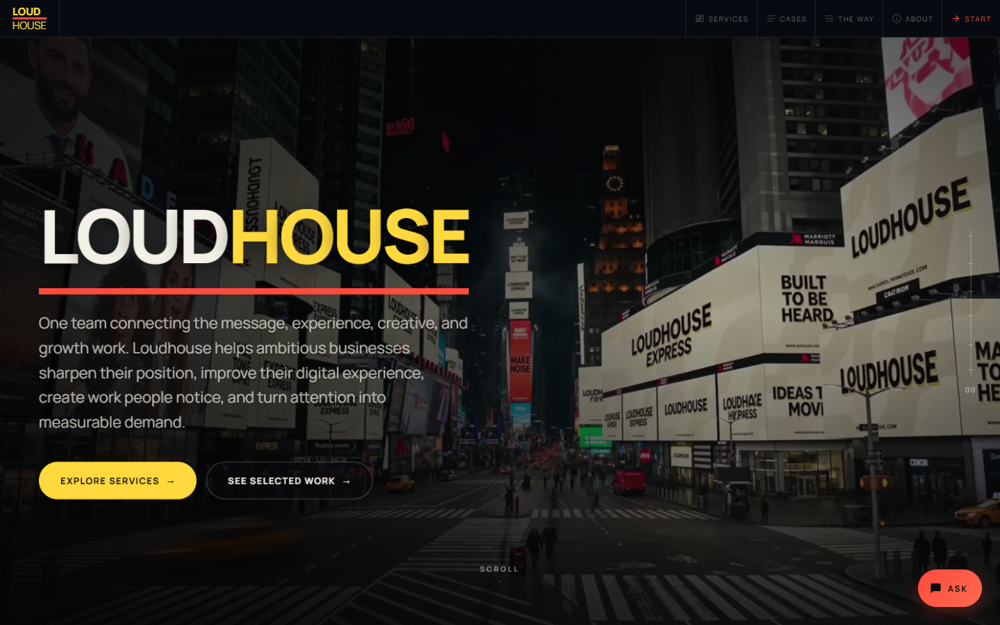

# Loudhouse Marketing

**Repository:** private
**Role:** full stack — front end, motion, API, SEO, deployment

## What it is

Loudhouse is a marketing agency in Islamabad. They take three clients at a time, give every job a reference number, and don't call a project finished until a number moves. The site had to carry that positioning, which ruled out a template — an agency selling attention can't have a site nobody looks at.

So the whole thing is built as a sequence of scenes. The home page opens on a Times Square scene with the brand on the billboards, About runs as a scroll-scrubbed film, Services and Work share a 3D speaker that comes apart as you scroll through it, and Cases is a set of numbered jobs presented like a confidential file.

Underneath the presentation it's a working MERN app: the contact form validates and stores leads in MongoDB and sends an email, a chatbot answers questions about the agency, and a short quiz recommends which services a visitor actually needs.

## Architecture

A monorepo with npm workspaces — a Vite/React client and an Express/MongoDB server.

The server runs as a normal Express app locally and as a Vercel serverless function in production, with the client carrying a thin `api/` directory for the deployed routes. Three endpoints: `/api/leads` for the contact form, `/api/chat` for the assistant, `/api/recommend` for the quiz.

Routing is client-side with React Router, with a Vercel rewrite sending everything that isn't an asset or an API call to `index.html`.

## The scroll film

The About page is the part I spent the most time on.

The idea was a cinematic sequence that scrubs off scroll position — scroll down and it plays forward, scroll up and it reverses, stop and it holds on the exact frame. The obvious way to do that is setting `video.currentTime`, but that isn't frame-deterministic across browsers: seek to the same time twice and you can get different frames, and on some engines it lands on the nearest keyframe instead.

Instead, a build script decodes the 4K master into WebP stills with a manifest, and a canvas paints the right still for the current scroll position. GSAP ScrollTrigger drives a target index and a rAF loop eases toward it, so scrubbing stays smooth rather than snapping frame to frame. HTML sections cross-fade over the pinned canvas.

That was fine on desktop and unusable on a phone. Every frame was held as a decoded `ImageBitmap`, which is uncompressed — 181 mobile stills at 1080×1920 works out to roughly 1.5 GB of bitmap on a handset, so the tab spent its time reclaiming memory instead of painting. Two changes fixed it without touching the art:

- scrub every second still on mobile, which over a shortened scrub distance still works out to about one frame per 4vh of travel
- decode straight to the size the canvas actually paints at, rather than at full resolution

That took it to roughly 139 MB, about a tenfold cut. Desktop keeps its full frame count and device pixel ratio; the resize only ever downscales, so nothing softens. `prefers-reduced-motion` skips the sequence entirely.

## The speaker

The exploded speaker on Services and Work is a procedural Three.js model rather than a loaded asset — rounded box geometry, standard materials, and a set of named parts registered so they can be driven independently.

It's built once and reused two ways: on Work it disassembles as you scroll, on Services it rotates on its own as an ambient hero object. Same geometry, different scene, lighting and animation around it. Building it in code rather than shipping a GLB meant no model download and easy control over which part moves when.

## AI features

Two endpoints, both proxying Groq server-side so the key never reaches the browser.

The **chatbot** gets a system prompt containing everything it's allowed to know about the agency and is told to answer only from that. Ask it anything off-topic and it declines and steers back. It defaults to one or two sentences and only expands when asked to — the brand voice is blunt, and a chatbot that waffles would undercut it. History is sanitised before it goes anywhere: roles filtered, content truncated, capped at the last ten turns.

The **recommender** runs a short discovery instead. It asks at most four questions, each one building on the previous answers, then returns a service stack. It emits structured JSON rather than prose — either `{done: false, question, options}` so the client can render option chips, or `{done: true, services, primary, name, brief, explanation}` for the final result. The brief has to describe the visitor's actual situation from their answers, not generic filler.

## SEO

No react-helmet — an SPA this size only needs title, description, canonical, Open Graph and one JSON-LD block kept in sync with the active route, so there's a small hook that upserts them and tags everything it creates so it can clean up on unmount.

Beyond that: a sitemap and robots.txt, permanent redirects for two legacy URLs, and immutable cache headers on the frame directories since those filenames never change.

## Testing the motion

Motion work is hard to check by eye, so there's a set of Puppeteer scripts under `tools/` that drive the real site: measuring scroll smoothness and frame timing, checking the loader-to-hero handoff doesn't tear, verifying nothing overflows horizontally at any viewport, confirming reduced-motion actually disables the sequences, comparing viewports against each other, and sweeping the console for errors. Most of the mobile performance work came out of what those scripts reported rather than what the page felt like.

## Stack

React 18 · Vite · React Router · Three.js · React Three Fiber · Drei · GSAP ScrollTrigger · Framer Motion · Anime.js · Lenis · Express · MongoDB · Mongoose · Nodemailer · Groq API · Puppeteer · Vercel
