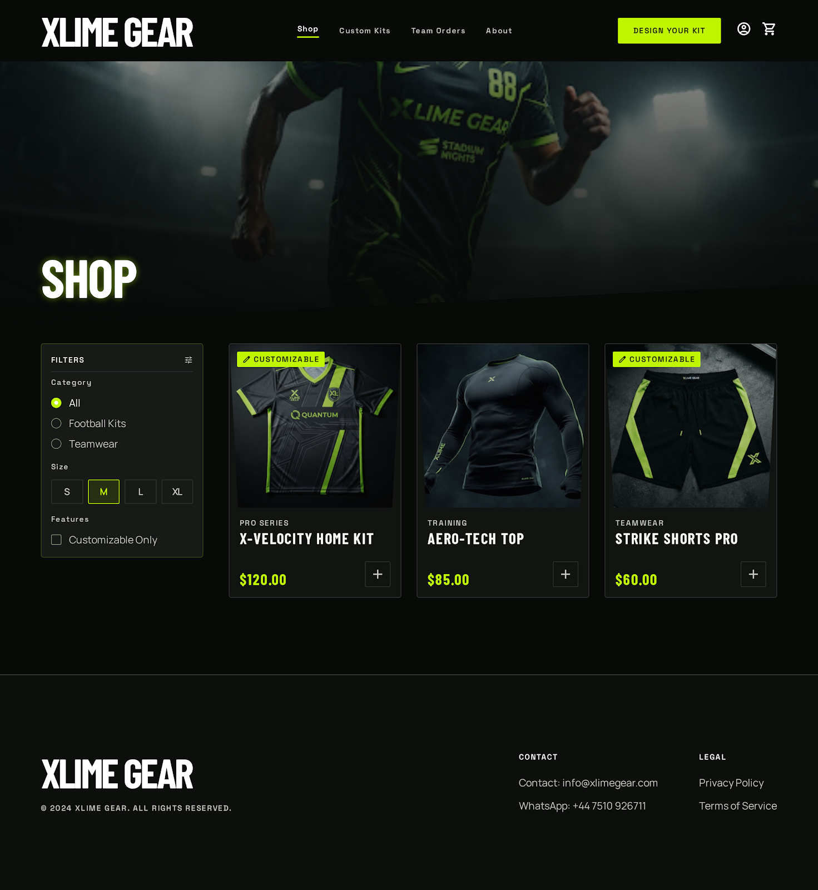
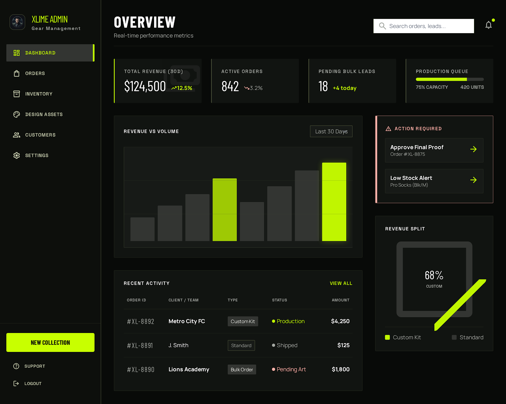

# XLIME GEAR

**Status:** design prototype — not deployed
**Repository:** private
**Role:** UI design, design system, prototype packaging

## What it is

XLIME GEAR is a custom football kit brand — teams design their own strip, order in bulk, and get it made. The prototype covers the full journey as thirteen screens:

**Storefront** — home, shop all (two layouts), football kit detail
**Customisation** — the custom jersey builder
**Ordering** — cart, checkout, team bulk orders (two versions), team request form
**Account** — my account
**Admin** — order overview, order detail

It's a design and front-end prototype rather than a running application. The screens are real HTML with a working design system behind them, built for a client to review and sign off before anything gets wired to a backend.

## The builder

The jersey builder is what the product actually sells, so it got the most attention.

It runs as four steps — kit, colours, crest, details — with the progress visible the whole time and a large preview of the current configuration on the left. Colour selection splits into a primary colour and separate trim and accent swatches, because those are two different decisions for a team and merging them into one palette makes both harder. The crest is a file upload with the accepted formats and size limit stated up front rather than surfaced as an error afterwards.

The step that shapes the rest of the flow is the last one: the primary action is **Review & Quote**, not *Add to cart*. Team kit is priced per job — quantity, print, crest complexity, delivery date all move the number — so the builder ends in a quote request with the unit count carried through. The regular shop side keeps a normal cart and checkout for stock items.

## Design system

Dark, high-contrast, one acid-green accent doing all the signalling. Condensed display type for headings against a neutral sans for body, which gives the storefront a sports-kit feel without needing decoration.

Colours are defined as semantic tokens — surface, surface elevated, surface container, on-surface, primary container, error and so on — extended into the Tailwind config rather than dropped inline. That means the admin screens and the storefront share one palette definition, and a change to the accent moves through all thirteen screens at once.

## Shipping it as one file

The client needed to review all thirteen screens, and asking them to run a dev server wasn't reasonable.

So the deliverable is a single self-contained HTML file: a branded landing page, a card per screen, and a device-framed viewer that runs each original page live rather than showing a picture of it. Every source file is embedded byte-for-byte alongside its screenshot — nothing stripped, nothing minified, nothing rewritten to fit.

A build script does the embedding, and a verification pass decodes every embedded page back out and byte-compares it against the original before the file is considered done. All thirteen came back identical. It gets rendered and checked end to end afterwards, which caught two layout problems in the shell itself — long filenames overflowing their cards, and the device frames shrinking out of proportion inside a flex container.

## Stack

HTML · Tailwind CSS · semantic design tokens · Google Fonts (Barlow Condensed, Manrope, Space Grotesk) · Material Symbols · Node.js packaging and verification script
